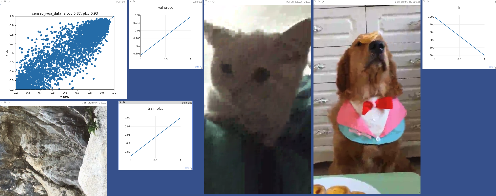

##  CenseoQoE-Algorithm: 模型训练
CenseoQoE的模型训练codebase参考了[mmlab](https://github.com/open-mmlab) 开源的mmdetection、mmpose等，我们将训练流程的
各个模块解耦，每个模块单独设计，最后整合在一起，方便后续的功能扩展。经过实验证明，没有使用太多的tricks, 这一整套训练流程使用简单
的模型就可以在各个公开数据集获得**Strong Baseline**。整个训练框架将图像/视频、有参/无参的画质评价统一起来，连同其他训练参数均只需
在一个config文件里更改，这可以让我们快速地进行实验。除此之外，我们提供数据转换脚本和模型转换脚本，数据转换脚本方便用户将CenseoQoE主观打分平台
或是其他主观打分平台的打分数据转成CenseoQoE训练统一使用的json格式，模型转换脚本可以将pytorch模型转成各种类型的模型
(onnx、torchscript、tensorflow saved_model等), 方便根据自己的需求做不同形式的模型部署。

### 环境安装
具体安装参照[README](../README.md)的环境安装。

### 数据准备
#### CenseoQoE 主观打分平台标注得到的数据
请参考[scripts/censeoqoe_platform_to_json.py](scripts/censeoqoe_platform_to_json.py)。该脚本是针对视频处理，如果是图片，不用运行`video2imgs`这个函数。
其中:
* `video_org_dir` 是打分视频的目录路径，所有的视频均应该保存在同一个目录下。
* `video_frames_save_dir` 是视频帧的保存路径。
* `json_in_path` 是censeo平台打分结束之后获得的json文件路径。
* `json_out_path` 是处理json文件的保存路径。
* 根据实际情况在脚本中更改这四个路径的实际值。如果视频有对应的参考视频，请在67行更改参考视频名称的提取方式，脚本中是根据视频名称提取得到。
* 更改完之后， 运行`python scripts/censeo_to_json.py`即可。
* 请记住设置的`video_frames_save_dir`和`json_out_path`，这在后面的模型训练将会用到。

#### 其他平台标注得到的数据
其他平台的或是公开数据集的标注数据格式各有不同，需要做一下转换，跟上述的转换大同小异，简单来说就是就两点：
1. 将数据保存成统一的输入json格式，可以参考[icme_ugcset_processed_test.json](./assets/icme_ugcset_processed_test.json)。
2. 如果是视频格式，需要抽帧并保存成图片。

下面以[ICME UGC视频画质评价比赛](http://ugcvqa.com/) 上的数据为例进行转换，
具体请参考[scripts/icme_ugc_to_censeo_json.py](scripts/icme_ugc_to_censeo_json.py)。
* `video_org_dir` 是[ICME UGC视频画质评价比赛](http://ugcvqa.com/) 上下载得到的视频保存路径。
* `video_frames_save_dir` 是视频帧的保存路径。
* `json_mos_path` 是[ICME UGC视频画质评价比赛](http://ugcvqa.com/) 上下载得到的mos json路径。
* `json_dmos_path` 是[ICME UGC视频画质评价比赛](http://ugcvqa.com/) 上下载得到的dmos json路径。
* `json_train_path` 是处理训练集json文件的保存路径。
* `json_val_path` 是处理测试集json文件的保存路径。
* 根据实际情况在脚本中更改这四个路径的实际值，更改完之后， 运行`python scripts/icme_ugc_to_censeo_json.py`即可。


### Config
如上所诉，整个模型训练流程所需要的配置我们希望在一个config文件中就能完成。config的说明请参考
[icme config](configs/baseline/ICME_UGC_VIDEO/icme_ugc_compressed_video_vqa_res18_basemodel_nr.py), 里面做了详细的说明。
上面做数据转换设置的视频帧保存路径和转换后的json路径分别在`data_roots`和`data_infos`更改即可。

### 模型训练
模型介绍见 [A strong baseline for image and video quality assessment](https://arxiv.org/abs/2111.07104) 。

**可以下载[Model Zoo](../README.md)里的pytorch模型，然后把模型路径放到config文件里的`resume_from`作为预训练模型进行训练**
* 单卡训练示例
```shell script
CUDA_VISIBLE_DEVICES=0 python train.py configs/ICME_UGC_VIDEO/icme_ugc_compressed_video_vqa_res18_basemodel_nr.py
```

* 单机多卡训练示例

将config文件里的`gpu_num`设置为使用的gpu数量
```shell script
CUDA_VISIBLE_DEVICES=0,1 python train.py configs/ICME_UGC_VIDEO/icme_ugc_compressed_video_vqa_res18_basemodel_nr.py
```

### 模型推理
**在对应的config文件中的`resume_from`设置为训练好的模型路径**
```
CUDA_VISIBLE_DEVICES=0 python inference.py \
 configs/ICME_UGC_VIDEO/icme_ugc_compressed_video_vqa_res18_basemodel_nr.py \
 --dst_path $DST_PATH$ \
 --ref_path $REF_PATH$ \
 --save_name $SAVE_NAME$

其中，
$DST_PATH是需要预测的文件路径，可以是视频或是图片，也可以是文件夹，如果是文件夹，默认将文件夹下的所有符合要求的文件都预测;
$REF_PATH是对应的参考文件路径，无参模型不用提供;
$SAVE_NAME 是结果保存的json文件名，非必须，如果不指定将生成带时间戳的json文件，并在最后将文件名打印出来。
```

### 可视化
训练过程可视化借助[visdom](https://github.com/fossasia/visdom) 实现，更多visdom使用请参考[visdom](https://github.com/fossasia/visdom)
* step 1: 后台保持运行visdom server。运行`python -m visdom.server -p 8082`，请自行设定相应的端口。
* step 2: 在config文件里设置
* step 3: 网页端打开 http://ip:port 就可以看到类似下面的训练过程了


### 模型转换
现在工业届其实很少直接拿pytorch模型部署，因为我们提供了相应的脚本做模型转换(onnx、torchscript、tensorflow saved_model等），具体见`scripts/pytorch2onnx_jit_pb.py`。
**在对应的config文件中的`resume_from`设置为训练好的模型路径**
```
CUDA_VISIBLE_DEVICES=-1 python scripts/pytorch2onnx_jit_pb.py configs/ICME_UGC_VIDEO/icme_ugc_compressed_video_vqa_res18_basemodel_nr.py
```

### 如何扩展
可以看到censeo-train的整个训练框架主要拆分为 [models](./models)、[datasets](./datasets)、[losses](./losses)和
[trainers](./trainers)共四个部分，这四个目录下我都写了一个参考基类，想要扩展模型、损失函数等请在相应的目录下参考或是继承
该基类来实现,然后在训练的config里选择自己实现的model_name、loss_name、dataset_name、trainer_name以及对应的kwargs参数等等。

后续我们会增加更多关于模型或是loss改进的实现，也期待大家能在该训练框架上做出自己的改进和贡献。

### TODO
- [ ] 集成更多业界开源的优秀算法模型

### 引用
